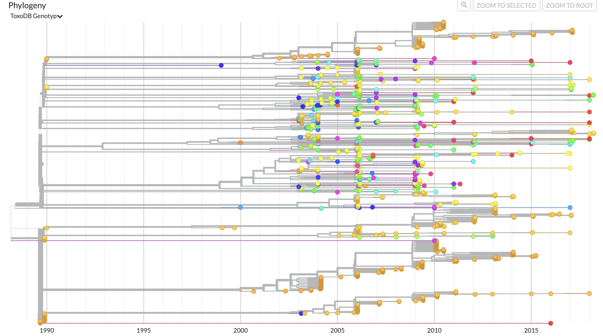

# Toxoplasma gondii GRA6 Phylogeny

A time-resolved phylogeny of **1,662 *Toxoplasma gondii* isolates** from 35 countries and
38 host species, built with [Nextstrain](https://nextstrain.org). *T. gondii* is a
protozoan parasite, so this pipeline is an adaptation of Nextstrain's viral tooling to a
single-locus eukaryotic marker — the GRA6 dense granule antigen gene.

Sachi Ramachandran and Dr. Chunlei Su · University of Tennessee, Knoxville · MICR 493

## Live visualization

**[View the interactive tree →](https://nextstrain.org/community/sachiramachandran/toxoplasma-gondii-analysis)**

<!-- Add your screenshot here: save the image to docs/auspice-overview.png -->


## What this build adds

Nextstrain's standard builds track RNA viruses: whole genomes, thousands of variable sites,
a strong molecular clock, and metadata that stops at date and location. Applying that
machinery to *T. gondii* required rebuilding most of those assumptions, and the result
carries several things a stock build does not.

**A single-locus marker that carries full isolate metadata.** The dataset holds 212 unique
GRA6 sequences — one per ToxoDB RFLP genotype — expanded across all 1,662 isolates via the
genotype key. That expansion is what lets one 297 bp gene tree carry host species,
geography, serology, and mouse virulence simultaneously, rather than being a bare
sequence-similarity dendrogram.

**A quantified New World / Old World diversity gradient.** *T. gondii* is famously clonal
in the northern hemisphere and wildly diverse in South America. This build puts numbers on
it:

| Region | Isolates | Distinct ToxoDB genotypes |
|---|---:|---:|
| South America | 610 | **155** |
| North America | 494 | 39 |
| Africa | 185 | 10 |
| Asia | 111 | 9 |
| Europe | 88 | **6** |
| Central America | 81 | 17 |
| Caribbean | 47 | 12 |

610 South American isolates yield 155 genotypes; 88 European isolates yield six. The
gradient is visible directly in the tree's branching structure, not just in a summary table.

**Mouse virulence mapped onto the phylogeny.** `mortality_percent` is exposed as a
continuous coloring across the 872 isolates with a recorded value — a virulence axis no
stock Nextstrain build has. It separates genotypes sharply:

| ToxoDB genotype | Isolates scored | Mean mouse mortality |
|---|---:|---:|
| #6 | 29 | **89.0%** |
| #13 | 35 | 22.9% |
| #8 | 21 | 13.9% |
| #7 | 19 | 13.2% |
| #1 | 62 | 3.6% |
| #2 | 81 | 1.2% |
| #3 | 110 | **0.0%** |
| #9 | 23 | 0.0% |

**Serology alongside sequence.** MAT titer is a second continuous coloring, covering 1,099
isolates, so serologic response can be read against genotype and host on the same tree.

**A clock retuned for a protozoan locus.** The reference is GenBank
[AF239291](https://www.ncbi.nlm.nih.gov/nuccore/AF239291) (740 bp, GRA6 CDS at 23–715).
`augur refine` runs at a clock rate of 8×10⁻⁴ ± 2×10⁻⁴ with `--keep-root` and
`--clock-filter-iqd 4`, replacing the tutorial's whole-genome RNA-virus defaults.

## Dataset at a glance

| | |
|---|---|
| Isolates | 1,662 |
| Locus | GRA6, 297 bp aligned to a 740 bp reference |
| ToxoDB RFLP genotypes | 212 |
| Countries | 35 (9 regions, 282 localities) |
| Host species | 38 — Chicken 598, Cat 329, Pig 220, Dog 94, Feral Pig 75, Sheep 61, … |
| Collection years | 1989–2018 |
| Source publications | 53 |
| MAT titer recorded | 1,099 isolates |
| Mouse mortality recorded | 872 isolates |

## How the pipeline works

Defined in [`Snakefile`](Snakefile) at the repository root. Each rule is a standard `augur`
command:

| Rule | What it does | Output |
|---|---|---|
| `index_sequences` | Index sequence composition for filtering | `results/sequence_index.tsv` |
| `filter` | Apply exclusions and sampling thresholds | `results/filtered.fasta` |
| `align` | Align to the GRA6 reference, filling gaps with N | `results/aligned.fasta` |
| `tree` | Infer the maximum-likelihood tree | `results/tree_raw.nwk` |
| `refine` | Fit the molecular clock, infer node dates | `results/tree.nwk` |
| `ancestral` | Reconstruct ancestral nucleotide states | `results/nt_muts.json` |
| `translate` | Derive amino acid changes across GRA6 | `results/aa_muts.json` |
| `traits` | Infer ancestral country assignments | `results/traits.json` |
| `export` | Assemble everything for Auspice | `auspice/toxoplasma-gondii-analysis.json` |

`data/toxoplasma_sequences.fasta` is a committed input, not a build product. It was produced
once by expanding the 212 genotype sequences in `data/toxo_expansion.txt` across the 1,662
isolate IDs in `data/toxo_rflp_1662_metadata.tsv`, keyed on ToxoDB genotype. Every FASTA
header matches a `strain` value in `data/toxo_meta3.tsv` exactly — that linkage is what the
whole build rests on.

## Running it

Install the [Nextstrain CLI](https://docs.nextstrain.org/en/latest/install.html), then set
up a runtime once:

```bash
nextstrain setup docker
```

Build from the repository root:

```bash
nextstrain build --docker .
```

View the result locally:

```bash
nextstrain view auspice/
```

The Snakefile lives at the repository root rather than inside `toxo-analysis/` for a
specific reason: nextstrain.org serves community builds from `auspice/<repo-name>.json` on
the default branch, and the Docker runtime mounts only the build directory. A Snakefile
inside `toxo-analysis/` could not write to the root `auspice/` at all. **`auspice/` is
deliberately tracked in git** — deleting it takes the published visualization offline.

To regenerate the geography and color configs after changing the metadata:

```bash
python3 toxo-analysis/scripts/build_lat_longs.py && python3 toxo-analysis/scripts/build_colors.py
```

## Repository layout

```
Snakefile                     the build; run from here
auspice/                      published JSON — tracked, served by nextstrain.org
docs/                         README images
toxo-analysis/
  config/
    ToxoplasmaOutgroup.gb     GRA6 reference (GenBank AF239291)
    auspice_config.json       titles, colorings, geo resolutions, panels
    colors.tsv                generated — all 6 categorical colorings
    lat_longs.tsv             generated — country, region, city
    dropped_strains.txt       exclusion list (currently empty)
  data/
    toxoplasma_sequences.fasta   LIVE  1,662 GRA6 sequences
    toxo_meta3.tsv               LIVE  1,662 isolates, the build's metadata
    toxo_expansion.txt           LIVE  212 genotype -> GRA6 sequence pairs
    toxo_rflp_1662_metadata.tsv  LIVE  isolate ID -> genotype mapping
    book2_sequence_OLD.fasta     superseded
    toxo_meta2.csv               superseded
    toxoplasma.fasta             superseded
    samples_1, samples_2         superseded
  old_data_backup/               superseded
  envs/nextstrain.yaml           conda environment, for running augur directly
  scripts/
    build_lat_longs.py        derives lat_longs.tsv from the metadata coordinates
    build_colors.py           derives colors.tsv from the metadata categories
  results/, logs/             generated, gitignored
```

`Toxo RFLP 1662 samples with coordinates.tsv` at the repository root is the original
upstream export, kept unmodified as a provenance record.

## Adapting this to another dataset

Five inputs need replacing. The details below are where this build originally went wrong,
so they are worth reading closely.

**`metadata.tsv`** — one row per isolate. Must include `strain`, `country`, and `date`.
Column names are case-sensitive and must be lowercase to match the config files. Any column
you want to color or filter by needs a matching entry in `auspice_config.json`.

**`sequences.fasta`** — headers must match the metadata `strain` column *exactly*. A
mismatch here silently drops isolates from the build.

**`reference.gb`** — a GenBank record with the CDS annotated, downloadable from NCBI.
`augur translate` needs the annotation to compute amino acid changes.

**`colors.tsv`** — three tab-separated columns: `<metadata column>`, `<value>`, `<hex>`.
The column name must match the metadata header exactly, **lowercase included**. Writing
`Country` where the metadata says `country` causes augur to match nothing and Auspice to
silently fall back to auto-assigned colors — with no warning.

**`lat_longs.tsv`** — four tab-separated columns: `<metadata column>`, `<value>`,
`<latitude>`, `<longitude>`. One row per *location value*, not per isolate. Augur has a
built-in country list it falls back to, so an ignored file looks like a working map with
some countries mysteriously missing.

Both config files are generated here rather than hand-maintained, precisely because both
failure modes above are silent. If your metadata carries per-isolate coordinates, adapt
`scripts/build_lat_longs.py` and `scripts/build_colors.py` — they guarantee coverage by
construction.

Then update the path constants at the top of the `Snakefile` and the `colorings` /
`geo_resolutions` in `auspice_config.json`.

## Caveats

These bound every claim above and are worth stating plainly.

- **Single locus.** This is a GRA6 gene tree, not a strain phylogeny. GRA6 alone cannot
  resolve recombinant lineages, and *T. gondii* recombines.
- **Identical sequences by construction.** Isolates sharing a ToxoDB genotype have the same
  GRA6 sequence, because sequences were expanded from a per-genotype representative. Tip
  clustering therefore reflects sampling effort as much as evolutionary relationship, and
  clade sizes should not be read as population sizes.
- **The time axis is weakly informed.** A molecular clock fit to 297 bp over a 29-year
  window carries little signal. Read the dating as relative ordering, not calendar dates.
- **Most coordinates are approximate.** 1,495 of 1,662 isolates carry `GIS-proxy`
  coordinates — country or region centroids — against 167 marked `GIS-exact`. This is
  exposed as the *Coordinate Precision* coloring so it is visible while reading the map.
- **Two filter thresholds are inherited no-ops.** `--min-date 1908` and
  `--sequences-per-group 500` come from the Zika tutorial; with dates spanning 1989–2018
  and no year exceeding 500 isolates, all 1,662 pass. They are kept so the thresholds are
  explicit if the dataset grows.
- **Some location labels are not countries.** `Plateau` is a Nigerian state, `Svalbard` a
  Norwegian territory, and `Congo` and `St. Kitts` are ambiguous short forms. These are
  kept as recorded rather than reinterpreted, and are mapped by explicit coordinates
  derived from the isolates themselves.
- **68 isolates have no locality** and do not render at city zoom.
- **Censored serologic titers were numified.** 41 MAT values recorded as inequalities
  (`>3200`, `<25`, …) were converted to their detection limit so they could be colored.
  This slightly understates the high titers and overstates the low ones.

## Credits

Built by Sachi Ramachandran with Dr. Chunlei Su, University of Tennessee, Knoxville. Isolate data is drawn from 53 published studies, cited per-isolate in the
`Reference` field and visible in the Auspice tree.

Adapted from the [Nextstrain Zika tutorial](https://github.com/nextstrain/zika-tutorial).
Built with [Augur and Auspice](https://docs.nextstrain.org/en/latest/index.html).
